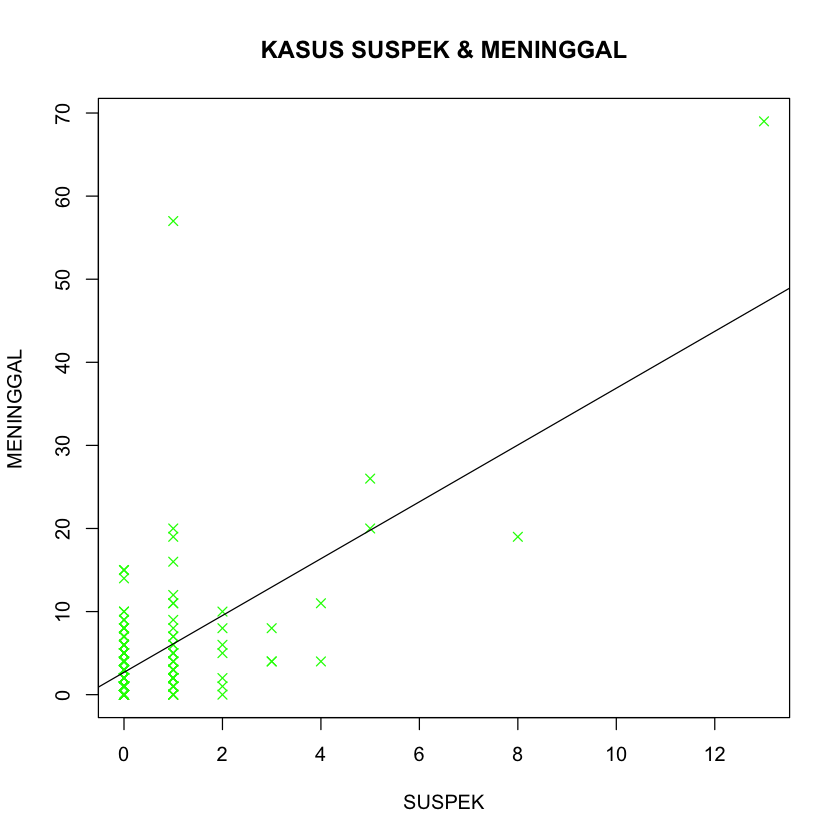

```R
getwd()
```


'/Users/synchziro'


```R
# Mencoba dengan dataset kasus Covid-19 Kabupaten Demak pada bulan Juli 2021
# Dataset diunduh dari laman data.go.id
```


```R
data <- read.csv("dataset.csv")
```


```R
print(is.data.frame(data))
print(ncol(data))
print(nrow(data))
```

    [1] TRUE
    [1] 13
    [1] 249


```R
print(data)
```

           KECAMATAN              DESA SUSPEK ODP KONTAKERAT
    1       Mranggen       Kembangarum      1  NA         55
    2       Mranggen          Mranggen      5  NA        106
    3       Mranggen          Kangkung      0  NA         69
    4       Mranggen        Kalitengah      0  NA         17
    5       Mranggen          Brumbung      1  NA         72
    6       Mranggen         Sumberejo      1  NA         30
    7       Mranggen       Bandungrejo      4  NA         46
    8       Mranggen             Menur      0  NA          5
    9       Mranggen       Ringinjajar      0  NA         15
    10      Mranggen         Candisari      0  NA         31
    11      Mranggen          Ngemplak      1  NA          5
    12      Mranggen        Karangsono      0  NA         13
    13      Mranggen             Jamus      1  NA         25
    14      Mranggen              Waru      0  NA          5
    15      Mranggen         Tegalarum      0  NA          7
    16      Mranggen         Tamansari      0  NA          4
    17      Mranggen         By.meneng      1  NA         21
    18      Mranggen        Kebonbatur      8  NA         63
    19      Mranggen         Batursari     13  NA        130
    20  Karangtengah          Wonowoso      1  NA         46
    21  Karangtengah           Sampang      0  NA         14
    22  Karangtengah     Tambakbulusan      0  NA          5
    23  Karangtengah          Pulosari      0  NA         89
    24  Karangtengah          Rejosari      0  NA         29
    25  Karangtengah             Ploso      0  NA          0
    26  Karangtengah         Wonokerto      0  NA         27
    27  Karangtengah        Karangsari      1  NA         40
    28  Karangtengah              Batu      0  NA         19
    29  Karangtengah          Donorejo      0  NA          0
    30  Karangtengah        Kedunguter      0  NA         23
    31  Karangtengah        Karangtowo      0  NA         22
    32  Karangtengah         Wonoagung      0  NA          4
    33  Karangtengah            Klitih      0  NA          6
    34  Karangtengah            Grogol      0  NA          9
    35  Karangtengah            Pidodo      0  NA          9
    36  Karangtengah             Dukun      0  NA          2
    37     Wonosalam          Botorejo      3  NA        351
    38     Wonosalam             Getas      0  NA          9
    39     Wonosalam            Kuncir      0  NA         79
    40     Wonosalam         Trengguli      0  NA         92
    41     Wonosalam            Mranak      0  NA         16
    42     Wonosalam        Pilangrejo      0  NA        165
    43     Wonosalam       Kerangkulon      0  NA         12
    44     Wonosalam         Sidomulyo      0  NA        101
    45     Wonosalam          Bunderan      0  NA         10
    46     Wonosalam        Mojo demak      0  NA         82
    47     Wonosalam            Mrisen      0  NA         64
    48     Wonosalam            Doreng      0  NA          0
    49     Wonosalam        Karangrowo      0  NA          3
    50     Wonosalam         Kalianyar      0  NA          3
    51     Wonosalam         Wonosalam      0  NA         23
    52     Wonosalam         Tlogorejo      0  NA          5
    53     Wonosalam         Tlogodowo      0  NA          7
    54     Wonosalam         Lempuyang      0  NA          3
    55     Wonosalam        Karangrejo      0  NA          6
    56     Wonosalam      Kendaldoyong      0  NA          2
    57     Wonosalam          Jogoloyo      1  NA         29
    58         Gajah         Kedondong      0  NA         11
    59         Gajah        Banjarsari      0  NA         34
    60         Gajah             Gajah      0  NA        114
    61         Gajah              Sari      0  NA         85
    62         Gajah          Boyolali      0  NA          4
    63         Gajah          Jatisono      0  NA         41
    64         Gajah         Sambiroto      0  NA          3
    65         Gajah      Tlg.pandogan      0  NA         22
    66         Gajah          Surodadi      0  NA          3
    67         Gajah        Gedangalas      0  NA         20
    68         Gajah           Sambung      0  NA         22
    69         Gajah         Tambirejo      1  NA          0
    70         Gajah        Mlatiharjo      0  NA         26
    71         Gajah          Mojosimo      0  NA          5
    72         Gajah            Medini      0  NA          7
    73         Gajah          Wilalung      0  NA         39
    74         Gajah      Tanjunganyar      0  NA         18
    75         Gajah           Mlekang      0  NA         10
    76   Karanganyar       Cangkring B      0  NA        163
    77   Karanganyar        Undaan Lor      0  NA         69
    78   Karanganyar        Undaan Kdl      0  NA         83
    79   Karanganyar         Ketanjung      0  NA         52
    80   Karanganyar Cangkring Rembang      0  NA         76
    81   Karanganyar             Tuang      0  NA         69
    82   Karanganyar          Wonorejo      1  NA        401
    83   Karanganyar    Ngemplik Wetan      0  NA        238
    84   Karanganyar       Karanganyar      0  NA        225
    85   Karanganyar          Ngaluran      1  NA        156
    86   Karanganyar       Kd waru Kdl      0  NA         26
    87   Karanganyar       Kd waru Lor      0  NA         21
    88   Karanganyar          Tugu Lor      0  NA         58
    89   Karanganyar           Kotakan      0  NA         11
    90   Karanganyar      Wonoketingal      0  NA        175
    91   Karanganyar          Jatirejo      0  NA         41
    92   Karanganyar       Bandungrejo      0  NA         35
    93          Mjen             Mijen      0  NA         38
    94          Mjen            Geneng      0  NA         16
    95          Mjen           Tanggul      0  NA          9
    96          Mjen      Banteng mati      0  NA         12
    97          Mjen            Mlaten      0  NA          9
    98          Mjen             Bermi      0  NA         18
    99          Mjen      Gempol songo      0  NA          7
    100         Mjen        Ngelowetan      0  NA         28
    101         Mjen            Bakung      1  NA         16
    102         Mjen             Pasir      0  NA         23
    103         Mjen            Jleper      0  NA         10
    104         Mjen          Rejosari      0  NA         25
    105         Mjen            Ngegot      0  NA          7
    106         Mjen             Pecuk      1  NA         22
    107         Mjen       Ngelo Kulon      0  NA          4
    108        Demak           Betokan      0  NA         36
    109        Demak         Kalicilik      0  NA         11
    110        Demak         Kadilangu      1  NA         14
    111        Demak         Singorejo      0  NA          9
    112        Demak       Karangmlati      0  NA         38
    113        Demak           Bintoro      1  NA        140
    114        Demak          Turirejo      0  NA          0
    115        Demak         Kedondong      0  NA          5
    116        Demak             Bango      0  NA          3
    117        Demak              Raji      0  NA          0
    118        Demak         Mulyorejo      0  NA          3
    119        Demak              Sedo      0  NA          5
    120        Demak              Bolo      0  NA          2
    121        Demak         Katonsari      1  NA        273
    122        Demak       Kalikondang      0  NA         37
    123        Demak            Cabean      0  NA         41
    124        Demak          Tempuran      0  NA        156
    125        Demak          Donorojo      0  NA         29
    126        Demak       Mangunjiwan      1  NA         33
    127       Bonang         Morodemak      0  NA         15
    128       Bonang         Purworejo      0  NA         10
    129       Bonang         Sumberejo      0  NA         36
    130       Bonang        Gebangarum      2  NA          2
    131       Bonang            Gebang      0  NA         16
    132       Bonang         Kembangan      0  NA          0
    133       Bonang        Karangrejo      0  NA          4
    134       Bonang          Sukodono      0  NA          8
    135       Bonang         Tlogoboyo      0  NA          3
    136       Bonang       Margolinduk      0  NA          2
    137       Bonang       Tridonorejo      0  NA         26
    138       Bonang          Wonosari      0  NA         92
    139       Bonang          Jatirogo      1  NA         15
    140       Bonang        Poncoharjo      0  NA         36
    141       Bonang              Jali      0  NA          4
    142       Bonang        Krajanboga      1  NA          6
    143       Bonang          Serangan      0  NA         37
    144       Bonang       Betahwalang      0  NA         41
    145       Bonang         Jatimulyo      0  NA          3
    146       Bonang            Weding      0  NA          8
    147       Bonang        Bonangrejo      0  NA         75
    148      Guntur           Temuroso      1  NA         34
    149      Guntur         Turitempel      0  NA          0
    150      Guntur          Tlogoweru      0  NA         22
    151      Guntur           Trimulyo      0  NA         12
    152      Guntur          Bakalrejo      1  NA         37
    153      Guntur          Tlogorejo      0  NA         15
    154      Guntur          Bumiharjo      0  NA         13
    155      Guntur          Sidoharjo      0  NA          7
    156      Guntur           Bogosari      1  NA         76
    157      Guntur             Guntur      0  NA         14
    158      Guntur            Blerong      1  NA         12
    159      Guntur           Pamongan      1  NA         45
    160      Guntur           Sukorejo      1  NA         10
    161      Guntur           Sarirejo      0  NA         40
    162      Guntur         Sidokumpul      0  NA        108
    163      Guntur               Gaji      0  NA          2
    164      Guntur          Banjarejo      0  NA         29
    165      Guntur            Krandon      0  NA         27
    166      Guntur            Tangkis      0  NA          2
    167      Guntur           Wonorejo      1  NA        101
    168   Karangawen          Bumirejo      0  NA         44
    169   Karangawen        Pundenarum      1  NA         25
    170   Karangawen           Kuripan      2  NA         33
    171   Karangawen          Brambang      2  NA         40
    172   Karangawen        Karangawen      1  NA         43
    173   Karangawen          Sidorejo      0  NA         37
    174   Karangawen         Wonosekar      1  NA         17
    175   Karangawen         Tlogorejo      1  NA        117
    176   Karangawen          Rejosari      3  NA         37
    177   Karangawen             Teluk      0  NA         26
    178   Karangawen         Margohayu      0  NA         42
    179   Karangawen           Jragung      2  NA         52
    180       Dempet     Harjowinangun      0  NA         41
    181       Dempet            Dempet      1  NA         34
    182       Dempet            Brakas      0  NA          4
    183       Dempet         Sidomulyo      2  NA         33
    184       Dempet       Gempoldenok      0  NA          5
    185       Dempet        Botosengon      0  NA         19
    186       Dempet             Merak      0  NA         22
    187       Dempet         Kebonsari      0  NA         22
    188       Dempet          Balerejo      1  NA         33
    189       Dempet        Karangrejo      1  NA          2
    190       Dempet          Baleromo      0  NA         13
    191       Dempet      Jeruk gulung      0  NA          0
    192       Dempet             Kunir      0  NA         26
    193       Dempet         Kedongori      0  NA         76
    194       Dempet              Kuwu      0  NA         29
    195       Dempet            Kramat      0  NA         20
    196   Kebonagung        Mangunrejo      0  NA         31
    197   Kebonagung          Tlogosih      1  NA         49
    198   Kebonagung          Megonten      1  NA         11
    199   Kebonagung         Sokokidul      1  NA         14
    200   Kebonagung       Pilangwetan      0  NA         29
    201   Kebonagung        Kebonagung      2  NA         24
    202   Kebonagung             Mijen      4  NA          8
    203   Kebonagung       Klampok Lor      0  NA          3
    204   Kebonagung           Werdoyo      0  NA          6
    205   Kebonagung             Babat      0  NA          6
    206   Kebonagung             Prigi      0  NA         13
    207   Kebonagung         Sarimulyo      0  NA         14
    208   Kebonagung          Solowire      1  NA         15
    209   Kebonagung      Mangunan Lor      3  NA         51
    210      Sayung             Bedono      0  NA         19
    211      Sayung            Gemulak      0  NA         17
    212      Sayung           Sriwulan      5  NA        112
    213      Sayung               Tugu      0  NA         45
    214      Sayung          Purwosari      0  NA         67
    215      Sayung           Surodadi      1  NA         12
    216      Sayung           Sidorejo      0  NA         16
    217      Sayung        Timbulsloko      0  NA         11
    218      Sayung         Banjarsari      0  NA         10
    219      Sayung          Sidogemah      1  NA         32
    220      Sayung         Tambakroto      0  NA          7
    221      Sayung          Kalisari       1  NA         11
    222      Sayung              Dombo      1  NA          4
    223      Sayung           Bulusari      2  NA          3
    224      Sayung          Jetaksari      0  NA         29
    225      Sayung         Karangasem      1  NA          2
    226      Sayung          Prampelan      0  NA          4
    227      Sayung             Sayung      1  NA         16
    228      Sayung         Pilangsari      1  NA         27
    229      Sayung            loireng      0  NA          4
    230       Wedung            Wedung      0  NA         27
    231       Wedung             Ruwit      0  NA          4
    232       Wedung             Bungo      0  NA         44
    233       Wedung            Ngawen      0  NA         11
    234       Wedung          Kenduren      0  NA         11
    235       Wedung              Buko      0  NA        119
    236       Wedung           Mandung      0  NA          0
    237       Wedung       Berahan Wtn      0  NA        100
    238       Wedung       Berahan Kln      0  NA         73
    239       Wedung            Tempel      0  NA          1
    240       Wedung      Kedungkarang      0  NA         51
    241       Wedung       KedungMutih      0  NA         88
    242       Wedung          Jungsemi      0  NA         14
    243       Wedung             Jetak      1  NA         28
    244       Wedung         Jungpasir      0  NA         18
    245       Wedung       Mutih kulon      1  NA         44
    246       Wedung       Mutih Wetan      0  NA         17
    247       Wedung        Kendalasem      0  NA          4
    248       Wedung           Babalan      0  NA         56
    249       Wedung           Tedunan      0  NA          2
        KONFIRMASI.YANGDIRAWATDIDEMAK ISOLASIMANDIRI
    1                               1              1
    2                               4              2
    3                               0              0
    4                               0              0
    5                               0              1
    6                               0              0
    7                               2              2
    8                               1              0
    9                               0              0
    10                              0              1
    11                              0              1
    12                              1              0
    13                              1              0
    14                              0              0
    15                              0              0
    16                              0              0
    17                              0              0
    18                              3              1
    19                              5              2
    20                              0              2
    21                              0              0
    22                              0              0
    23                              0              0
    24                              0              0
    25                              0              1
    26                              0              0
    27                              0              0
    28                              0              0
    29                              0              0
    30                              0              0
    31                              0              0
    32                              0              0
    33                              0              0
    34                              0              0
    35                              0              1
    36                              0              0
    37                              1              1
    38                              0              0
    39                              0              0
    40                              0              0
    41                              0              0
    42                              0              1
    43                              0              0
    44                              1              2
    45                              0              0
    46                              0              2
    47                              0              0
    48                              0              1
    49                              1              0
    50                              0              0
    51                              0              0
    52                              0              0
    53                              0              0
    54                              0              0
    55                              0              1
    56                              0              0
    57                              0              3
    58                              0              0
    59                              0              0
    60                              0              0
    61                              0              0
    62                              0              0
    63                              0              0
    64                              0              1
    65                              0              0
    66                              0              0
    67                              0              0
    68                              0              0
    69                              0              0
    70                              0              0
    71                              0              0
    72                              0              0
    73                              0              0
    74                              0              0
    75                              0              0
    76                              0              0
    77                              0              0
    78                              0              0
    79                              0              0
    80                              0              0
    81                              0              0
    82                              0              0
    83                              0              0
    84                              0              0
    85                              0              1
    86                              0              0
    87                              0              0
    88                              0              0
    89                              0              0
    90                              0              1
    91                              0              0
    92                              0              0
    93                              0              1
    94                              0              0
    95                              0              0
    96                              0              0
    97                              0              0
    98                              0              0
    99                              0              0
    100                             0              0
    101                             0              0
    102                             0              0
    103                             0              2
    104                             0              0
    105                             0              0
    106                             0              0
    107                             0              0
    108                             0              2
    109                             1              0
    110                             0              0
    111                             0              0
    112                             0              0
    113                             1              9
    114                             0              0
    115                             0              0
    116                             0              1
    117                             1              0
    118                             0              0
    119                             0              0
    120                             0              0
    121                             0              3
    122                             0              0
    123                             0              0
    124                             0              1
    125                             0              0
    126                             6              2
    127                             0              0
    128                             0              0
    129                             0              0
    130                             0              0
    131                             0              0
    132                             0              0
    133                             0              0
    134                             0              0
    135                             1              0
    136                             0              0
    137                             0              1
    138                             0              0
    139                             0              0
    140                             0              0
    141                             0              0
    142                             0              0
    143                             0              0
    144                             0              0
    145                             0              0
    146                             0              0
    147                             0              0
    148                             0              0
    149                             0              0
    150                             1              1
    151                             0              0
    152                             0              0
    153                             0              0
    154                             0              2
    155                             0              0
    156                             0              0
    157                             1              0
    158                             0              0
    159                             2              0
    160                             1              0
    161                             0              1
    162                             0              0
    163                             0              0
    164                             0              0
    165                             1              0
    166                             0              0
    167                             1              1
    168                             1              0
    169                             0              3
    170                             0              1
    171                             0              2
    172                             0              1
    173                             0              0
    174                             0              0
    175                             0              0
    176                             2              0
    177                             0              1
    178                             0              2
    179                             0              0
    180                             0              0
    181                             0              0
    182                             0              0
    183                             0              1
    184                             0              0
    185                             0              1
    186                             0              0
    187                             0              0
    188                             0              0
    189                             0              0
    190                             0              0
    191                             0              0
    192                             1              0
    193                             0              0
    194                             0              0
    195                             0              2
    196                             0              1
    197                             0              0
    198                             1              0
    199                             0              0
    200                             0              0
    201                             0              0
    202                             0              0
    203                             0              0
    204                             0              1
    205                             0              0
    206                             0              0
    207                             0              0
    208                             0              1
    209                             0              0
    210                             0              0
    211                             0              0
    212                             0              1
    213                             0              0
    214                             0              1
    215                             1              1
    216                             0              1
    217                             0              0
    218                             0              0
    219                             0              0
    220                             0              0
    221                             0              0
    222                             0              0
    223                             0              1
    224                             0              0
    225                             0              0
    226                             0              0
    227                             0              0
    228                             0              1
    229                             0              0
    230                             0              0
    231                             0              0
    232                             0              0
    233                             0              0
    234                             0              1
    235                             0              0
    236                             0              0
    237                             0              0
    238                             0              0
    239                             0              0
    240                             0              0
    241                             0              0
    242                             0              0
    243                             0              0
    244                             0              0
    245                             0              0
    246                             0              0
    247                             0              0
    248                             0              0
    249                             0              0
        KONFIRMASI.YANGDIRAWATDILUAR.DEMAK ISOMANLUAR SEMBUHLUAR SEMBUHDALAM
    1                                    7          0         30          48
    2                                    9          1         61         107
    3                                    1          0         22          23
    4                                    2          0         12          22
    5                                    1          0         18          44
    6                                    2          0         24          32
    7                                    2          0         49          59
    8                                    1          1         13          13
    9                                    1          0         40          45
    10                                   1          1          8          14
    11                                   1          0         11          20
    12                                   0          0         15          12
    13                                   0          0         20          36
    14                                   3          0          9          12
    15                                   2          0         12          28
    16                                   1          0          7          20
    17                                   1          0         19          20
    18                                   8          0         79         105
    19                                  24          8        244         339
    20                                   0          0          9          15
    21                                   0          0          6           8
    22                                   0          0          0           2
    23                                   1          0         10          21
    24                                   0          0          2          15
    25                                   1          0          2           2
    26                                   0          0          8          19
    27                                   0          0         15          45
    28                                   0          0          8          11
    29                                   0          0          5          14
    30                                   0          0          7           6
    31                                   0          0          9           7
    32                                   1          0          1           3
    33                                   0          0          4           5
    34                                   0          0          4           9
    35                                   2          0          0           8
    36                                   0          0          7           8
    37                                   0          0          4          50
    38                                   1          0          2           4
    39                                   0          0          0          14
    40                                   0          0          7          24
    41                                   0          1          5          24
    42                                   1          1          7          19
    43                                   0          0          5           9
    44                                   0          0          3          23
    45                                   0          0          3           3
    46                                   0          0          2          10
    47                                   0          0          5           9
    48                                   0          0          1           6
    49                                   0          0          4           2
    50                                   0          0          2           5
    51                                   0          0          9          35
    52                                   0          0          0           7
    53                                   0          0          3           8
    54                                   0          0          0           2
    55                                   0          0          5          21
    56                                   0          0          1          12
    57                                   1          0         10          64
    58                                   0          0          4          10
    59                                   1          0         14          14
    60                                   1          0         15          46
    61                                   0          0          7          13
    62                                   1          0          1           8
    63                                   0          0          7          16
    64                                   0          0          2           4
    65                                   0          0          3           6
    66                                   0          0          5           1
    67                                   0          0          8          16
    68                                   1          0          7          13
    69                                   0          0          8          12
    70                                   0          0         11           6
    71                                   0          0          4           8
    72                                   0          0          5           8
    73                                   0          0         18          13
    74                                   0          0          2           5
    75                                   0          0         10          11
    76                                   0          0         12           8
    77                                   0          0          7          33
    78                                   0          0          8          10
    79                                   0          0         14          19
    80                                   0          0          4          24
    81                                   0          0          4          21
    82                                   0          0         27          35
    83                                   1          0         13          33
    84                                   0          0         47          56
    85                                   0          1         17          24
    86                                   0          0         20          40
    87                                   0          1         17          37
    88                                   0          0         17          33
    89                                   0          0          5          17
    90                                   0          0         17          20
    91                                   0          2          4           6
    92                                   0          0          8           7
    93                                   0          0         18          61
    94                                   0          0          5          15
    95                                   0          0          2           3
    96                                   1          1          2           5
    97                                   0          0          2          21
    98                                   0          0          1           7
    99                                   0          0          5           9
    100                                  0          0          4          13
    101                                  0          0          3          16
    102                                  1          0         10          10
    103                                  0          1          8           8
    104                                  0          0          4          12
    105                                  0          0          4           8
    106                                  1          0         11          16
    107                                  0          0          4           4
    108                                  0          0          4          41
    109                                  0          0          6          20
    110                                  0          0         14          28
    111                                  0          0          1          11
    112                                  0          0          1          20
    113                                  5          1         81         304
    114                                  0          0          3           5
    115                                  0          0          7          10
    116                                  1          0         15          26
    117                                  0          0          1           7
    118                                  0          0          5          13
    119                                  0          0         12          24
    120                                  1          0         11          34
    121                                  0          0         32         148
    122                                  1          0          9          36
    123                                  1          0          8          51
    124                                  0          0          4          30
    125                                  0          0          3           7
    126                                  1          0         28         196
    127                                  0          0          1          25
    128                                  0          0          5          24
    129                                  0          0          4          12
    130                                  0          0          4          15
    131                                  0          0          0           5
    132                                  0          0          1           1
    133                                  0          0          2          14
    134                                  0          0          4           5
    135                                  0          0          3          20
    136                                  0          0          1          10
    137                                  0          0          2          39
    138                                  0          0          4          15
    139                                  1          0          3          16
    140                                  0          0          1          16
    141                                  0          0          2          10
    142                                  0          0          2           8
    143                                  0          0          2          34
    144                                  0          0          2          21
    145                                  0          0          1          10
    146                                  0          0          2          19
    147                                  0          0          4          16
    148                                  1          0          8          14
    149                                  0          0          4          15
    150                                  0          0          3          23
    151                                  0          0          1           6
    152                                  0          0          9          26
    153                                  0          0          3           5
    154                                  0          0          4          21
    155                                  0          0          1           6
    156                                  0          0         11          38
    157                                  0          0          7          42
    158                                  0          0          7          33
    159                                  0          2          8          31
    160                                  0          0          4          15
    161                                  0          0          4          21
    162                                  2          0          6          26
    163                                  0          0          4          21
    164                                  0          0          2          14
    165                                  0          1          1           4
    166                                  0          0          2           8
    167                                  0          0          8          25
    168                                  1          0          8          52
    169                                  2          1         14          56
    170                                  4          0         34          96
    171                                  3          0         30          97
    172                                  0          0         21          55
    173                                  4          0         16          58
    174                                  0          1         17           7
    175                                  1          0         15          33
    176                                  2          0         21          54
    177                                  0          0         10          28
    178                                  1          0         10          25
    179                                  0          1         15          19
    180                                  0          0          7          29
    181                                  0          0          4          33
    182                                  0          0          2           6
    183                                  1          0         11          15
    184                                  0          0          4           4
    185                                  0          0          5          24
    186                                  0          0          2          21
    187                                  0          0          5          12
    188                                  0          0          3          16
    189                                  0          0          2           5
    190                                  1          0          2          16
    191                                  0          0          1           0
    192                                  0          0          4           5
    193                                  1          0          1          22
    194                                  0          0          7          21
    195                                  0          1          4          22
    196                                  0          1          8          14
    197                                  0          0          2          12
    198                                  0          0          2           5
    199                                  0          0          3           6
    200                                  0          0          9           4
    201                                  1          0         16          29
    202                                  1          0         21          18
    203                                  0          0          5           1
    204                                  0          0          2           2
    205                                  0          0          3          10
    206                                  0          0          0           8
    207                                  0          0          5           5
    208                                  0          0          3           9
    209                                  0          0          3          10
    210                                  0          0          8           2
    211                                  0          0          9           7
    212                                  2          4         86          35
    213                                  2          0          7          13
    214                                  1          0         17          19
    215                                  0          0          4          18
    216                                  0          0          3           6
    217                                  0          0          1           4
    218                                  0          0          1           9
    219                                  2          0         14          12
    220                                  2          0          7          10
    221                                  0          0         18          15
    222                                  1          0          5           3
    223                                  0          0          7           5
    224                                  0          0          5           5
    225                                  0          0          8           7
    226                                  0          0         10           4
    227                                  1          1         16          14
    228                                  0          0         10           9
    229                                  0          0         13          12
    230                                  0          0          7          27
    231                                  0          0          1           4
    232                                  1          0          8          15
    233                                  0          0          3           6
    234                                  1          0          4          10
    235                                  0          0          5          19
    236                                  0          0          0           0
    237                                  0          0          3          12
    238                                  0          0          2           3
    239                                  0          0          0           4
    240                                  0          0          6          11
    241                                  0          1         12          25
    242                                  0          1          8           7
    243                                  0          1          5           9
    244                                  1          0          7          10
    245                                  0          0          9          12
    246                                  1          0          3          10
    247                                  0          0          2           7
    248                                  0          0          7          22
    249                                  0          0          2           5
        MENINGGAL PUSKESMAS
    1          11         0
    2          20         0
    3           8         0
    4           3         0
    5          11         0
    6           3         0
    7          11         0
    8           5         0
    9           8         0
    10          3         0
    11          1         0
    12          4         0
    13          1         0
    14          3         0
    15          6         0
    16          5         0
    17          4        10
    18         19         0
    19         69        13
    20          4         0
    21          1         0
    22          4         0
    23          8         0
    24          0         0
    25          0         0
    26          2         0
    27         16         0
    28          5         0
    29          3         0
    30          3         0
    31          6         0
    32          1         0
    33          3         0
    34          1         0
    35          1         0
    36          1         0
    37          8         0
    38          1         0
    39          6         0
    40          6         0
    41         14         0
    42          6         0
    43          3         0
    44          7         0
    45          2         0
    46          4         0
    47          4         0
    48          0         0
    49          1         0
    50          2         0
    51          5         0
    52          1         0
    53          1         0
    54          1         0
    55          5         0
    56          0         0
    57          6         0
    58          1         0
    59          3         3
    60          8         2
    61          3         3
    62          0         0
    63          1         2
    64          0         0
    65          2         0
    66          2         0
    67          2         2
    68          2         0
    69          3         0
    70          1         0
    71          1         0
    72          1         0
    73          3         0
    74          1         0
    75          4         0
    76          6         0
    77          1         0
    78          2         0
    79          5         0
    80          1         0
    81          0         0
    82          5         4
    83          4         0
    84         15         3
    85          7         0
    86          7         0
    87          6         0
    88          2         0
    89          1         0
    90          2         0
    91          0         0
    92          4         0
    93          5         0
    94          5         0
    95          0         0
    96          0         0
    97          2         0
    98          3         0
    99          1         0
    100         0         0
    101         2         0
    102         8         0
    103         2         0
    104         2         0
    105         1         0
    106         9         0
    107         0         0
    108         8         0
    109        10         0
    110         8         0
    111         3         0
    112         3         0
    113        57         0
    114         4         0
    115         1         0
    116        15         0
    117         1         0
    118         3         0
    119         4         0
    120         7         0
    121        19         0
    122         7         0
    123        15         0
    124         8         0
    125         0         0
    126        20         0
    127         4         0
    128         9         0
    129         4         0
    130         0         0
    131         0         0
    132         0         0
    133         1         0
    134         3         0
    135         2         0
    136         3         0
    137         5         0
    138         5         5
    139         2         2
    140         5         3
    141         2        13
    142         1         2
    143         4        16
    144         3        17
    145         0         1
    146         1         4
    147         1         5
    148         3         0
    149         1         0
    150         2         0
    151         1         0
    152         2         0
    153         0         0
    154         5         0
    155         0         0
    156         2         0
    157         0         0
    158         6         0
    159         2         0
    160         2         2
    161         3         0
    162         2         0
    163         4         0
    164         5         0
    165         2         0
    166         1         0
    167         1         0
    168        10         0
    169         5         0
    170        10         0
    171         8         0
    172         7         0
    173         9         0
    174         2         0
    175        12         0
    176         4         0
    177         2         0
    178         1         0
    179         6         0
    180         7         0
    181         4         0
    182         0         0
    183         5         0
    184         0         0
    185         3         0
    186         1         0
    187         1         0
    188         2         0
    189         0         0
    190         2         0
    191         1         0
    192         0         0
    193         4         0
    194         1         0
    195         0         0
    196         4         0
    197         5         0
    198         0         0
    199         1         0
    200         4         0
    201         1         1
    202         4         0
    203         2         0
    204         3         0
    205         1         0
    206         3         0
    207         2         0
    208         0         0
    209         4         0
    210         2         0
    211         7         0
    212        26         0
    213         2         0
    214         9         0
    215         0         0
    216         2         0
    217         0         0
    218         2         0
    219         4         0
    220         2         0
    221         1         0
    222         2        26
    223         2         0
    224         5        20
    225         2         0
    226         2        19
    227         5         0
    228         3         0
    229         4         0
    230         5         0
    231         1         0
    232         6         0
    233         2         0
    234         4         0
    235         1         0
    236         0         0
    237         2         0
    238         2         0
    239         0         0
    240         2         0
    241         2         0
    242         1         0
    243         2         0
    244         5         0
    245         3         0
    246         1         0
    247         0         0
    248         5         0
    249         0         0


```R
# Mendapat kasus suspek terbanyak.
susp <- max(data$SUSPEK)
print(susp)
```

    [1] 13


```R
# Mendapat detail kasus suspek terbanyak.
detsusp <- subset(data, SUSPEK == max(SUSPEK))
print(detsusp)
```

       KECAMATAN      DESA SUSPEK ODP KONTAKERAT KONFIRMASI.YANGDIRAWATDIDEMAK
    19  Mranggen Batursari     13  NA        130                             5
       ISOLASIMANDIRI KONFIRMASI.YANGDIRAWATDILUAR.DEMAK ISOMANLUAR SEMBUHLUAR
    19              2                                 24          8        244
       SEMBUHDALAM MENINGGAL PUSKESMAS
    19         339        69        13


```R
# Mendapat data dari satu kecamatan tertentu.
detkec <- subset( data, KECAMATAN == "Wonosalam")
print(detkec)
```

       KECAMATAN         DESA SUSPEK ODP KONTAKERAT KONFIRMASI.YANGDIRAWATDIDEMAK
    37 Wonosalam     Botorejo      3  NA        351                             1
    38 Wonosalam        Getas      0  NA          9                             0
    39 Wonosalam       Kuncir      0  NA         79                             0
    40 Wonosalam    Trengguli      0  NA         92                             0
    41 Wonosalam       Mranak      0  NA         16                             0
    42 Wonosalam   Pilangrejo      0  NA        165                             0
    43 Wonosalam  Kerangkulon      0  NA         12                             0
    44 Wonosalam    Sidomulyo      0  NA        101                             1
    45 Wonosalam     Bunderan      0  NA         10                             0
    46 Wonosalam   Mojo demak      0  NA         82                             0
    47 Wonosalam       Mrisen      0  NA         64                             0
    48 Wonosalam       Doreng      0  NA          0                             0
    49 Wonosalam   Karangrowo      0  NA          3                             1
    50 Wonosalam    Kalianyar      0  NA          3                             0
    51 Wonosalam    Wonosalam      0  NA         23                             0
    52 Wonosalam    Tlogorejo      0  NA          5                             0
    53 Wonosalam    Tlogodowo      0  NA          7                             0
    54 Wonosalam    Lempuyang      0  NA          3                             0
    55 Wonosalam   Karangrejo      0  NA          6                             0
    56 Wonosalam Kendaldoyong      0  NA          2                             0
    57 Wonosalam     Jogoloyo      1  NA         29                             0
       ISOLASIMANDIRI KONFIRMASI.YANGDIRAWATDILUAR.DEMAK ISOMANLUAR SEMBUHLUAR
    37              1                                  0          0          4
    38              0                                  1          0          2
    39              0                                  0          0          0
    40              0                                  0          0          7
    41              0                                  0          1          5
    42              1                                  1          1          7
    43              0                                  0          0          5
    44              2                                  0          0          3
    45              0                                  0          0          3
    46              2                                  0          0          2
    47              0                                  0          0          5
    48              1                                  0          0          1
    49              0                                  0          0          4
    50              0                                  0          0          2
    51              0                                  0          0          9
    52              0                                  0          0          0
    53              0                                  0          0          3
    54              0                                  0          0          0
    55              1                                  0          0          5
    56              0                                  0          0          1
    57              3                                  1          0         10
       SEMBUHDALAM MENINGGAL PUSKESMAS
    37          50         8         0
    38           4         1         0
    39          14         6         0
    40          24         6         0
    41          24        14         0
    42          19         6         0
    43           9         3         0
    44          23         7         0
    45           3         2         0
    46          10         4         0
    47           9         4         0
    48           6         0         0
    49           2         1         0
    50           5         2         0
    51          35         5         0
    52           7         1         0
    53           8         1         0
    54           2         1         0
    55          21         5         0
    56          12         0         0
    57          64         6         0


```R
# Visualisasi data kasus suspek & meninggal.
plot(x = data$SUSPEK,
     y = data$MENINGGAL,
     xlab = "SUSPEK",
     ylab = "MENINGGAL",
     col = "green",
     pch = 4,
     main = "KASUS SUSPEK & MENINGGAL")
 
abline(lm(data$MENINGGAL ~ data$SUSPEK,
          data = data), col = "black")
```


    

    


```R
# Magister Teknik Informatika
# Universitas Islam Negeri Maulana Malik Ibrahim Malang
# Machine Learning
# Dosen : Totok Chamidy, M.Kom
# Muhammad Syaiful Anwar 
# 2021
```
