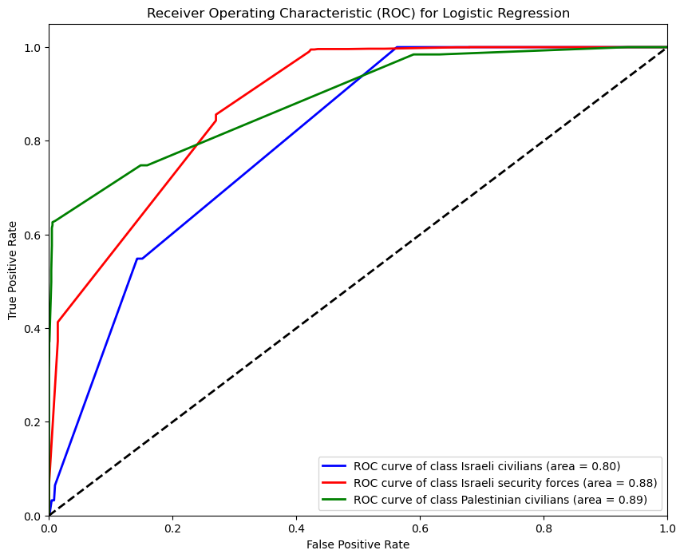
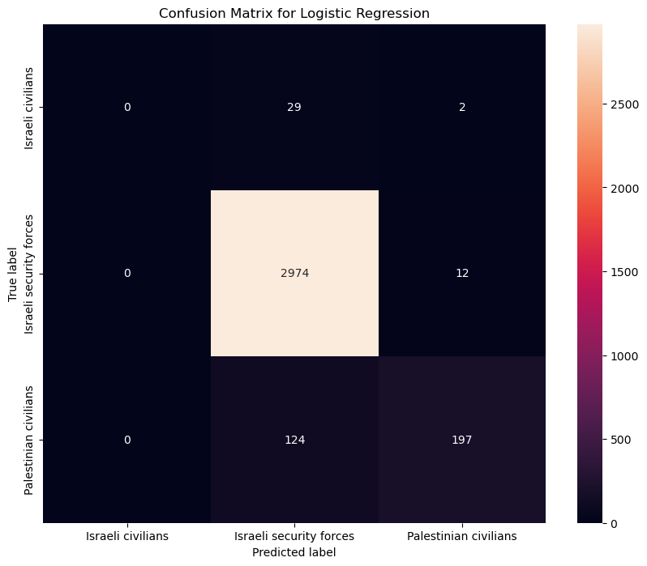
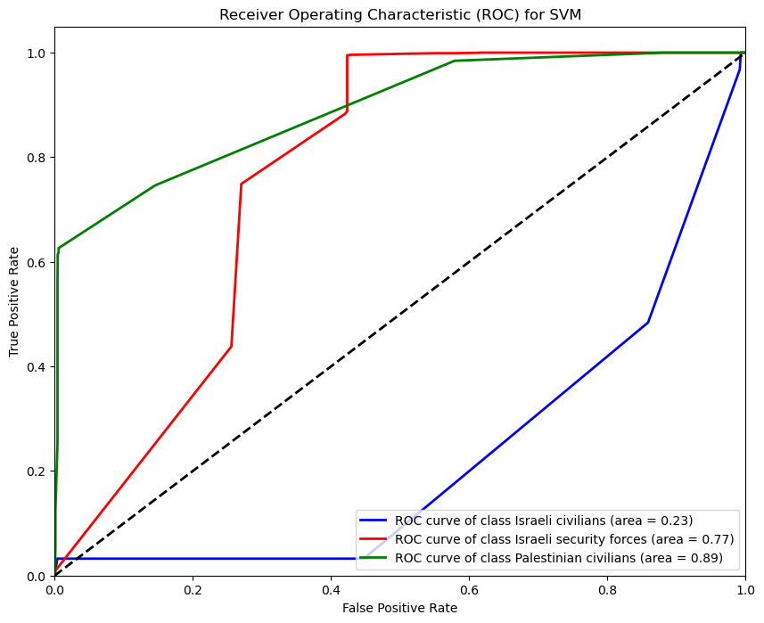
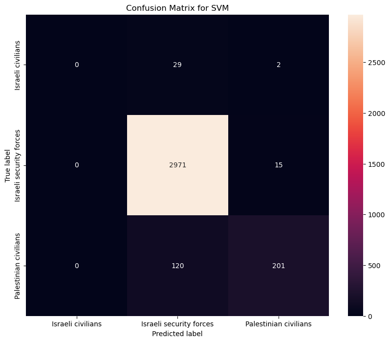
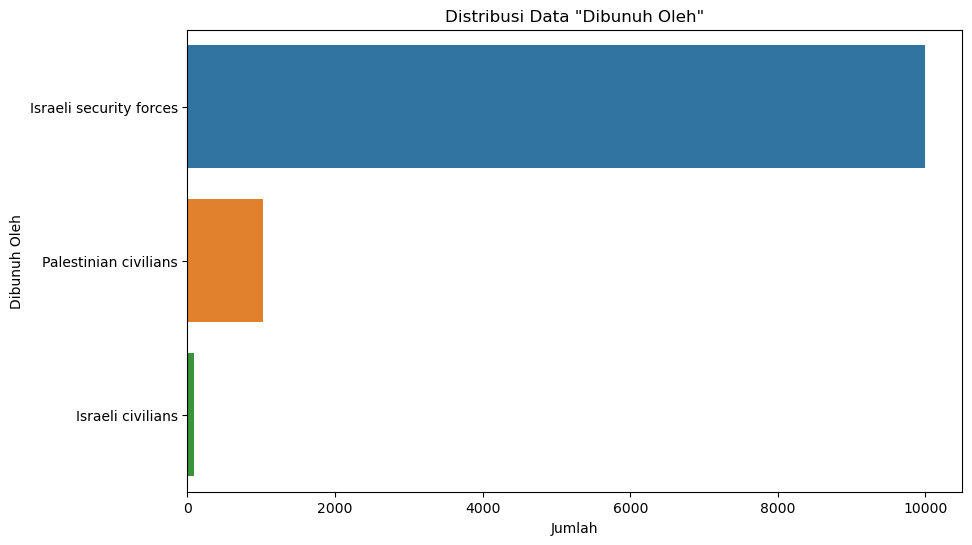
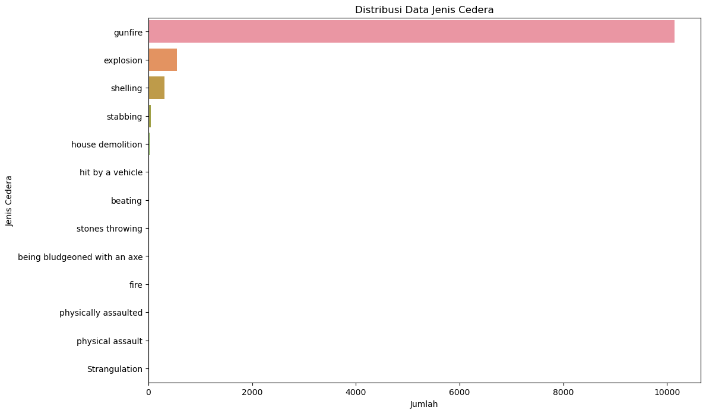

```python
import pandas as pd
```


```python
data = pd.read_csv(r"C:\Users\Lena\Documents\PASCA\Datasets\Kaggle - Fatalities in Palestine Israel\archive\fatalities_isr_pse_conflict_2000_to_2023.csv")
```


```python
data.head()
```


<div>
<style scoped>
    .dataframe tbody tr th:only-of-type {
        vertical-align: middle;
    }

    .dataframe tbody tr th {
        vertical-align: top;
    }

    .dataframe thead th {
        text-align: right;
    }
</style>
<table border="1" class="dataframe">
  <thead>
    <tr style="text-align: right;">
      <th></th>
      <th>name</th>
      <th>date_of_event</th>
      <th>age</th>
      <th>citizenship</th>
      <th>event_location</th>
      <th>event_location_district</th>
      <th>event_location_region</th>
      <th>date_of_death</th>
      <th>gender</th>
      <th>took_part_in_the_hostilities</th>
      <th>place_of_residence</th>
      <th>place_of_residence_district</th>
      <th>type_of_injury</th>
      <th>ammunition</th>
      <th>killed_by</th>
      <th>notes</th>
    </tr>
  </thead>
  <tbody>
    <tr>
      <th>0</th>
      <td>'Abd a-Rahman Suleiman Muhammad Abu Daghash</td>
      <td>2023-09-24</td>
      <td>32.0</td>
      <td>Palestinian</td>
      <td>Nur Shams R.C.</td>
      <td>Tulkarm</td>
      <td>West Bank</td>
      <td>2023-09-24</td>
      <td>M</td>
      <td>NaN</td>
      <td>Nur Shams R.C.</td>
      <td>Tulkarm</td>
      <td>gunfire</td>
      <td>live ammunition</td>
      <td>Israeli security forces</td>
      <td>Fatally shot by Israeli forces while standing ...</td>
    </tr>
    <tr>
      <th>1</th>
      <td>Usayed Farhan Muhammad 'Ali Abu 'Ali</td>
      <td>2023-09-24</td>
      <td>21.0</td>
      <td>Palestinian</td>
      <td>Nur Shams R.C.</td>
      <td>Tulkarm</td>
      <td>West Bank</td>
      <td>2023-09-24</td>
      <td>M</td>
      <td>NaN</td>
      <td>Nur Shams R.C.</td>
      <td>Tulkarm</td>
      <td>gunfire</td>
      <td>live ammunition</td>
      <td>Israeli security forces</td>
      <td>Fatally shot by Israeli forces while trying to...</td>
    </tr>
    <tr>
      <th>2</th>
      <td>'Abdallah 'Imad Sa'ed Abu Hassan</td>
      <td>2023-09-22</td>
      <td>16.0</td>
      <td>Palestinian</td>
      <td>Kfar Dan</td>
      <td>Jenin</td>
      <td>West Bank</td>
      <td>2023-09-22</td>
      <td>M</td>
      <td>NaN</td>
      <td>al-Yamun</td>
      <td>Jenin</td>
      <td>gunfire</td>
      <td>live ammunition</td>
      <td>Israeli security forces</td>
      <td>Fatally shot by soldiers while firing at them ...</td>
    </tr>
    <tr>
      <th>3</th>
      <td>Durgham Muhammad Yihya al-Akhras</td>
      <td>2023-09-20</td>
      <td>19.0</td>
      <td>Palestinian</td>
      <td>'Aqbat Jaber R.C.</td>
      <td>Jericho</td>
      <td>West Bank</td>
      <td>2023-09-20</td>
      <td>M</td>
      <td>NaN</td>
      <td>'Aqbat Jaber R.C.</td>
      <td>Jericho</td>
      <td>gunfire</td>
      <td>live ammunition</td>
      <td>Israeli security forces</td>
      <td>Shot in the head by Israeli forces while throw...</td>
    </tr>
    <tr>
      <th>4</th>
      <td>Raafat 'Omar Ahmad Khamaisah</td>
      <td>2023-09-19</td>
      <td>15.0</td>
      <td>Palestinian</td>
      <td>Jenin R.C.</td>
      <td>Jenin</td>
      <td>West Bank</td>
      <td>2023-09-19</td>
      <td>M</td>
      <td>NaN</td>
      <td>Jenin</td>
      <td>Jenin</td>
      <td>gunfire</td>
      <td>live ammunition</td>
      <td>Israeli security forces</td>
      <td>Wounded by soldiers’ gunfire after running awa...</td>
    </tr>
  </tbody>
</table>
</div>


```python
missing_values = data[['age', 'type_of_injury', 'killed_by', 'citizenship']].isnull().sum()
missing_values
```


    age               129
    type_of_injury    291
    killed_by           0
    citizenship         0
    dtype: int64


```python
median_age = data['age'].median()
data['age'].fillna(median_age, inplace=True)
```


```python
mode_type_of_injury = data['type_of_injury'].mode()[0]
data['type_of_injury'].fillna(mode_type_of_injury, inplace=True)
```


```python
updated_missing_values = data[['age', 'type_of_injury', 'killed_by', 'citizenship']].isnull().sum()
updated_missing_values
```


    age               0
    type_of_injury    0
    killed_by         0
    citizenship       0
    dtype: int64


```python
ammunition_distribution = data['ammunition'].value_counts()
type_of_injury_distribution = data['type_of_injury'].value_counts()
killed_by_distribution = data['killed_by'].value_counts()

ammunition_distribution, type_of_injury_distribution, killed_by_distribution
```


    (missile                        2877
     live ammunition                1514
     shell                           675
     explosive belt                  326
     bomb                            249
     mortar fire                      51
     knife                            37
     flechette shells                 22
     rubber-coated metal bullets      19
     0.22-caliber bullets             16
     phosphorus shell                 16
     Qassam rocket                    15
     car bomb                         15
     teargas canister                 13
     rocket                           12
     grad rocket                       7
     sponge rounds                     2
     grenade                           2
     flare bomb                        1
     stun grenade                      1
     rock                              1
     Name: ammunition, dtype: int64,
     gunfire                         10140
     explosion                         555
     shelling                          311
     stabbing                           48
     house demolition                   25
     hit by a vehicle                   18
     beating                             9
     stones throwing                     6
     being bludgeoned with an axe        4
     fire                                4
     physically assaulted                2
     physical assault                    1
     Strangulation                       1
     Name: type_of_injury, dtype: int64,
     Israeli security forces    10000
     Palestinian civilians       1028
     Israeli civilians             96
     Name: killed_by, dtype: int64)


```python
#Pembuatan model prediksi
from sklearn.preprocessing import OneHotEncoder

features = data[['ammunition', 'type_of_injury']]
target = data['killed_by']

encoder = OneHotEncoder(sparse=False)
features_encoded = encoder.fit_transform(features)

encoded_feature_names = encoder.get_feature_names_out(['ammunition', 'type_of_injury'])
features_encoded_df = pd.DataFrame(features_encoded, columns=encoded_feature_names)

features_encoded_df.head()
```


<div>
<style scoped>
    .dataframe tbody tr th:only-of-type {
        vertical-align: middle;
    }

    .dataframe tbody tr th {
        vertical-align: top;
    }

    .dataframe thead th {
        text-align: right;
    }
</style>
<table border="1" class="dataframe">
  <thead>
    <tr style="text-align: right;">
      <th></th>
      <th>ammunition_0.22-caliber bullets</th>
      <th>ammunition_Qassam rocket</th>
      <th>ammunition_bomb</th>
      <th>ammunition_car bomb</th>
      <th>ammunition_explosive belt</th>
      <th>ammunition_flare bomb</th>
      <th>ammunition_flechette shells</th>
      <th>ammunition_grad rocket</th>
      <th>ammunition_grenade</th>
      <th>ammunition_knife</th>
      <th>...</th>
      <th>type_of_injury_explosion</th>
      <th>type_of_injury_fire</th>
      <th>type_of_injury_gunfire</th>
      <th>type_of_injury_hit by a vehicle</th>
      <th>type_of_injury_house demolition</th>
      <th>type_of_injury_physical assault</th>
      <th>type_of_injury_physically assaulted</th>
      <th>type_of_injury_shelling</th>
      <th>type_of_injury_stabbing</th>
      <th>type_of_injury_stones throwing</th>
    </tr>
  </thead>
  <tbody>
    <tr>
      <th>0</th>
      <td>0.0</td>
      <td>0.0</td>
      <td>0.0</td>
      <td>0.0</td>
      <td>0.0</td>
      <td>0.0</td>
      <td>0.0</td>
      <td>0.0</td>
      <td>0.0</td>
      <td>0.0</td>
      <td>...</td>
      <td>0.0</td>
      <td>0.0</td>
      <td>1.0</td>
      <td>0.0</td>
      <td>0.0</td>
      <td>0.0</td>
      <td>0.0</td>
      <td>0.0</td>
      <td>0.0</td>
      <td>0.0</td>
    </tr>
    <tr>
      <th>1</th>
      <td>0.0</td>
      <td>0.0</td>
      <td>0.0</td>
      <td>0.0</td>
      <td>0.0</td>
      <td>0.0</td>
      <td>0.0</td>
      <td>0.0</td>
      <td>0.0</td>
      <td>0.0</td>
      <td>...</td>
      <td>0.0</td>
      <td>0.0</td>
      <td>1.0</td>
      <td>0.0</td>
      <td>0.0</td>
      <td>0.0</td>
      <td>0.0</td>
      <td>0.0</td>
      <td>0.0</td>
      <td>0.0</td>
    </tr>
    <tr>
      <th>2</th>
      <td>0.0</td>
      <td>0.0</td>
      <td>0.0</td>
      <td>0.0</td>
      <td>0.0</td>
      <td>0.0</td>
      <td>0.0</td>
      <td>0.0</td>
      <td>0.0</td>
      <td>0.0</td>
      <td>...</td>
      <td>0.0</td>
      <td>0.0</td>
      <td>1.0</td>
      <td>0.0</td>
      <td>0.0</td>
      <td>0.0</td>
      <td>0.0</td>
      <td>0.0</td>
      <td>0.0</td>
      <td>0.0</td>
    </tr>
    <tr>
      <th>3</th>
      <td>0.0</td>
      <td>0.0</td>
      <td>0.0</td>
      <td>0.0</td>
      <td>0.0</td>
      <td>0.0</td>
      <td>0.0</td>
      <td>0.0</td>
      <td>0.0</td>
      <td>0.0</td>
      <td>...</td>
      <td>0.0</td>
      <td>0.0</td>
      <td>1.0</td>
      <td>0.0</td>
      <td>0.0</td>
      <td>0.0</td>
      <td>0.0</td>
      <td>0.0</td>
      <td>0.0</td>
      <td>0.0</td>
    </tr>
    <tr>
      <th>4</th>
      <td>0.0</td>
      <td>0.0</td>
      <td>0.0</td>
      <td>0.0</td>
      <td>0.0</td>
      <td>0.0</td>
      <td>0.0</td>
      <td>0.0</td>
      <td>0.0</td>
      <td>0.0</td>
      <td>...</td>
      <td>0.0</td>
      <td>0.0</td>
      <td>1.0</td>
      <td>0.0</td>
      <td>0.0</td>
      <td>0.0</td>
      <td>0.0</td>
      <td>0.0</td>
      <td>0.0</td>
      <td>0.0</td>
    </tr>
  </tbody>
</table>
<p>5 rows × 35 columns</p>
</div>


```python
#Implementasi regresi logistik
from sklearn.model_selection import train_test_split
from sklearn.linear_model import LogisticRegression
from sklearn.metrics import classification_report

X_train, X_test, y_train, y_test = train_test_split(features_encoded_df, target, test_size=0.3, random_state=42)

log_reg_model = LogisticRegression(max_iter=1000)
log_reg_model.fit(X_train, y_train)

y_pred = log_reg_model.predict(X_test)

classification_report_results = classification_report(y_test, y_pred)
classification_report_results
```

    C:\Users\Lena\anaconda3\lib\site-packages\sklearn\metrics\_classification.py:1318: UndefinedMetricWarning: Precision and F-score are ill-defined and being set to 0.0 in labels with no predicted samples. Use `zero_division` parameter to control this behavior.
      _warn_prf(average, modifier, msg_start, len(result))
    C:\Users\Lena\anaconda3\lib\site-packages\sklearn\metrics\_classification.py:1318: UndefinedMetricWarning: Precision and F-score are ill-defined and being set to 0.0 in labels with no predicted samples. Use `zero_division` parameter to control this behavior.
      _warn_prf(average, modifier, msg_start, len(result))
    C:\Users\Lena\anaconda3\lib\site-packages\sklearn\metrics\_classification.py:1318: UndefinedMetricWarning: Precision and F-score are ill-defined and being set to 0.0 in labels with no predicted samples. Use `zero_division` parameter to control this behavior.
      _warn_prf(average, modifier, msg_start, len(result))
    


    '                         precision    recall  f1-score   support\n\n      Israeli civilians       0.00      0.00      0.00        31\nIsraeli security forces       0.95      1.00      0.97      2986\n  Palestinian civilians       0.93      0.61      0.74       321\n\n               accuracy                           0.95      3338\n              macro avg       0.63      0.54      0.57      3338\n           weighted avg       0.94      0.95      0.94      3338\n'


```python
#Diagram ROC LR
from sklearn.metrics import roc_curve, auc, RocCurveDisplay
import matplotlib.pyplot as plt

fpr = dict()
tpr = dict()
roc_auc = dict()
n_classes = y_train.nunique()
classes = log_reg_model.classes_

y_test_bin = pd.get_dummies(y_test, columns=classes).to_numpy()

y_score = log_reg_model.predict_proba(X_test)

for i in range(n_classes):
    fpr[i], tpr[i], _ = roc_curve(y_test_bin[:, i], y_score[:, i])
    roc_auc[i] = auc(fpr[i], tpr[i])

plt.figure(figsize=(10, 8))

colors = ['blue', 'red', 'green']
for i, color in zip(range(n_classes), colors):
    plt.plot(fpr[i], tpr[i], color=color, lw=2,
             label='ROC curve of class {0} (area = {1:0.2f})'
             ''.format(classes[i], roc_auc[i]))

plt.plot([0, 1], [0, 1], 'k--', lw=2)
plt.xlim([0.0, 1.0])
plt.ylim([0.0, 1.05])
plt.xlabel('False Positive Rate')
plt.ylabel('True Positive Rate')
plt.title('Receiver Operating Characteristic (ROC) for Logistic Regression')
plt.legend(loc="lower right")
plt.show()
```


    

    


```python
#Confusion matrix LR
from sklearn.metrics import confusion_matrix
import seaborn as sns

conf_mat = confusion_matrix(y_test, y_pred)

plt.figure(figsize=(10, 8))
sns.heatmap(conf_mat, annot=True, fmt="d", 
            xticklabels=log_reg_model.classes_,
            yticklabels=log_reg_model.classes_)
plt.title('Confusion Matrix for Logistic Regression')
plt.ylabel('True label')
plt.xlabel('Predicted label')
plt.show()
```


    

    


```python
#Implementasi SVM
from sklearn.svm import SVC

svm_model = SVC()
svm_model.fit(X_train, y_train)

y_pred_svm = svm_model.predict(X_test)

classification_report_svm = classification_report(y_test, y_pred_svm)
classification_report_svm
```

    C:\Users\Lena\anaconda3\lib\site-packages\sklearn\metrics\_classification.py:1318: UndefinedMetricWarning: Precision and F-score are ill-defined and being set to 0.0 in labels with no predicted samples. Use `zero_division` parameter to control this behavior.
      _warn_prf(average, modifier, msg_start, len(result))
    C:\Users\Lena\anaconda3\lib\site-packages\sklearn\metrics\_classification.py:1318: UndefinedMetricWarning: Precision and F-score are ill-defined and being set to 0.0 in labels with no predicted samples. Use `zero_division` parameter to control this behavior.
      _warn_prf(average, modifier, msg_start, len(result))
    C:\Users\Lena\anaconda3\lib\site-packages\sklearn\metrics\_classification.py:1318: UndefinedMetricWarning: Precision and F-score are ill-defined and being set to 0.0 in labels with no predicted samples. Use `zero_division` parameter to control this behavior.
      _warn_prf(average, modifier, msg_start, len(result))
    


    '                         precision    recall  f1-score   support\n\n      Israeli civilians       0.00      0.00      0.00        31\nIsraeli security forces       0.95      0.99      0.97      2986\n  Palestinian civilians       0.92      0.63      0.75       321\n\n               accuracy                           0.95      3338\n              macro avg       0.62      0.54      0.57      3338\n           weighted avg       0.94      0.95      0.94      3338\n'


```python
#Diagram ROC SVM
from sklearn.preprocessing import label_binarize

y_test_bin_svm = label_binarize(y_test, classes=classes)

y_score_svm = svm_model.decision_function(X_test)

fpr_svm = dict()
tpr_svm = dict()
roc_auc_svm = dict()

for i in range(n_classes):
    fpr_svm[i], tpr_svm[i], _ = roc_curve(y_test_bin_svm[:, i], y_score_svm[:, i])
    roc_auc_svm[i] = auc(fpr_svm[i], tpr_svm[i])

plt.figure(figsize=(10, 8))

for i, color in zip(range(n_classes), colors):
    plt.plot(fpr_svm[i], tpr_svm[i], color=color, lw=2,
             label='ROC curve of class {0} (area = {1:0.2f})'
             ''.format(classes[i], roc_auc_svm[i]))

plt.plot([0, 1], [0, 1], 'k--', lw=2)
plt.xlim([0.0, 1.0])
plt.ylim([0.0, 1.05])
plt.xlabel('False Positive Rate')
plt.ylabel('True Positive Rate')
plt.title('Receiver Operating Characteristic (ROC) for SVM')
plt.legend(loc="lower right")
plt.show()
```


    

    


```python
#Confusion Matrix SVM
conf_mat_svm = confusion_matrix(y_test, y_pred_svm)

plt.figure(figsize=(10, 8))
sns.heatmap(conf_mat_svm, annot=True, fmt="d", 
            xticklabels=svm_model.classes_,
            yticklabels=svm_model.classes_)
plt.title('Confusion Matrix for SVM')
plt.ylabel('True label')
plt.xlabel('Predicted label')
plt.show()
```


    

    


```python
#Perbandingan LR dan SVM
from sklearn.metrics import accuracy_score, precision_score, recall_score, f1_score

accuracy_lr = accuracy_score(y_test, y_pred)
precision_lr = precision_score(y_test, y_pred, average='weighted')
recall_lr = recall_score(y_test, y_pred, average='weighted')
f1_score_lr = f1_score(y_test, y_pred, average='weighted')

accuracy_svm = accuracy_score(y_test, y_pred_svm)
precision_svm = precision_score(y_test, y_pred_svm, average='weighted')
recall_svm = recall_score(y_test, y_pred_svm, average='weighted')
f1_score_svm = f1_score(y_test, y_pred_svm, average='weighted')

performance_comparison = pd.DataFrame({
    'Metric': ['Accuracy', 'Precision', 'Recall', 'F1 Score'],
    'Logistic Regression': [accuracy_lr, precision_lr, recall_lr, f1_score_lr],
    'SVM': [accuracy_svm, precision_svm, recall_svm, f1_score_svm]
})

performance_comparison.set_index('Metric', inplace=True)
performance_comparison

```

    C:\Users\Lena\anaconda3\lib\site-packages\sklearn\metrics\_classification.py:1318: UndefinedMetricWarning: Precision is ill-defined and being set to 0.0 in labels with no predicted samples. Use `zero_division` parameter to control this behavior.
      _warn_prf(average, modifier, msg_start, len(result))
    C:\Users\Lena\anaconda3\lib\site-packages\sklearn\metrics\_classification.py:1318: UndefinedMetricWarning: Precision is ill-defined and being set to 0.0 in labels with no predicted samples. Use `zero_division` parameter to control this behavior.
      _warn_prf(average, modifier, msg_start, len(result))
    


<div>
<style scoped>
    .dataframe tbody tr th:only-of-type {
        vertical-align: middle;
    }

    .dataframe tbody tr th {
        vertical-align: top;
    }

    .dataframe thead th {
        text-align: right;
    }
</style>
<table border="1" class="dataframe">
  <thead>
    <tr style="text-align: right;">
      <th></th>
      <th>Logistic Regression</th>
      <th>SVM</th>
    </tr>
    <tr>
      <th>Metric</th>
      <th></th>
      <th></th>
    </tr>
  </thead>
  <tbody>
    <tr>
      <th>Accuracy</th>
      <td>0.949970</td>
      <td>0.950270</td>
    </tr>
    <tr>
      <th>Precision</th>
      <td>0.940563</td>
      <td>0.940493</td>
    </tr>
    <tr>
      <th>Recall</th>
      <td>0.949970</td>
      <td>0.950270</td>
    </tr>
    <tr>
      <th>F1 Score</th>
      <td>0.941623</td>
      <td>0.942244</td>
    </tr>
  </tbody>
</table>
</div>


```python
#Rubah menjadi persentase
performance_comparison_percentage = performance_comparison * 100
performance_comparison_percentage
```


<div>
<style scoped>
    .dataframe tbody tr th:only-of-type {
        vertical-align: middle;
    }

    .dataframe tbody tr th {
        vertical-align: top;
    }

    .dataframe thead th {
        text-align: right;
    }
</style>
<table border="1" class="dataframe">
  <thead>
    <tr style="text-align: right;">
      <th></th>
      <th>Logistic Regression</th>
      <th>SVM</th>
    </tr>
    <tr>
      <th>Metric</th>
      <th></th>
      <th></th>
    </tr>
  </thead>
  <tbody>
    <tr>
      <th>Accuracy</th>
      <td>94.997004</td>
      <td>95.026962</td>
    </tr>
    <tr>
      <th>Precision</th>
      <td>94.056332</td>
      <td>94.049348</td>
    </tr>
    <tr>
      <th>Recall</th>
      <td>94.997004</td>
      <td>95.026962</td>
    </tr>
    <tr>
      <th>F1 Score</th>
      <td>94.162253</td>
      <td>94.224373</td>
    </tr>
  </tbody>
</table>
</div>


```python
#Distribusi amunisi
plt.figure(figsize=(12, 8))
sns.countplot(y=data['ammunition'], order = data['ammunition'].value_counts().index)
plt.title('Distribusi Data Jenis Amunisi')
plt.xlabel('Jumlah')
plt.ylabel('Jenis Amunisi')
plt.show()
```


    

    


```python
#Distribusi killed by
plt.figure(figsize=(10, 6))
sns.countplot(y=data['killed_by'], order=data['killed_by'].value_counts().index)
plt.title('Distribusi Data "Dibunuh Oleh"')
plt.xlabel('Jumlah')
plt.ylabel('Dibunuh Oleh')
plt.show()
```


    

    


```python
#Distribusi jenis cedera
plt.figure(figsize=(12, 8))
sns.countplot(y=data['type_of_injury'], order=data['type_of_injury'].value_counts().index)
plt.title('Distribusi Data Jenis Cedera')
plt.xlabel('Jumlah')
plt.ylabel('Jenis Cedera')
plt.show()
```


    

    


```python

```
